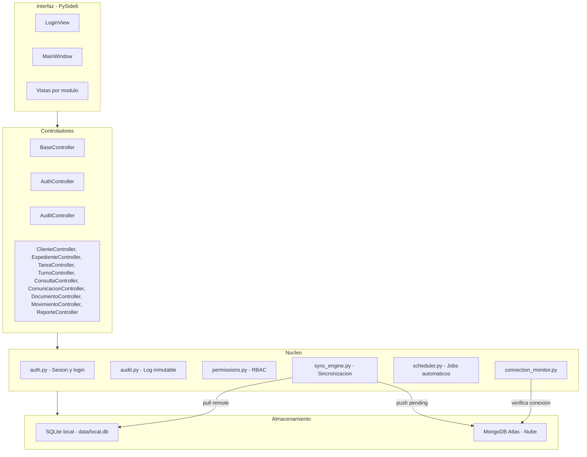
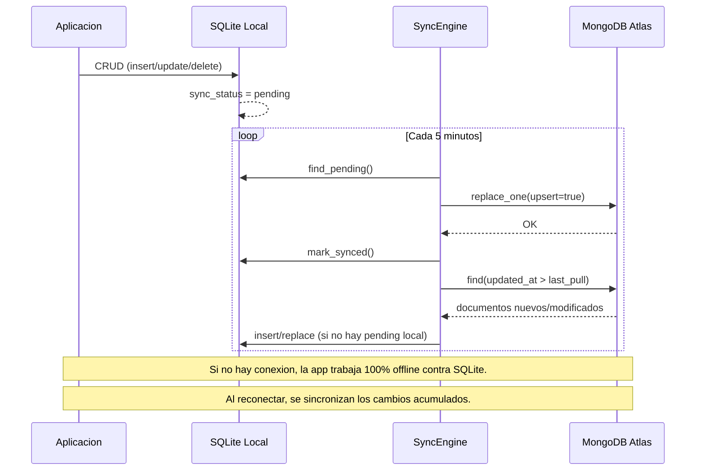

# Sistema Rampazzo

Sistema de gestion integral para estudio juridico previsional. Aplicacion de escritorio construida con **Python** y **PySide6** (Qt), con base de datos local **SQLite** y sincronizacion bidireccional con **MongoDB Atlas**.

Diseñado para gestionar el ciclo completo de un estudio: desde la consulta inicial del cliente, pasando por la apertura de carpetas, seguimiento de tareas y turnos ANSES, hasta el cobro de honorarios y la generacion de reportes.

---

## Stack tecnologico

| Tecnologia | Version minima | Rol en el sistema |
|---|---|---|
| **Python** | 3.12+ | Lenguaje principal |
| **PySide6** | 6.6.0 | Interfaz grafica de escritorio (Qt for Python) |
| **SQLite** | incluido en Python | Base de datos local (cache offline) |
| **MongoDB Atlas** | - | Base de datos remota (fuente de verdad central) |
| **pymongo** | 4.6.0 | Driver de conexion a MongoDB |
| **dnspython** | 2.4.0 | Resolucion DNS para conexiones SRV de Atlas |
| **bcrypt** | 4.1.0 | Hashing seguro de contraseñas |
| **APScheduler** | 3.10.0 | Programacion de tareas automaticas (sync, backups, alertas) |
| **reportlab** | 4.1.0 | Generacion de reportes en PDF |
| **matplotlib** | 3.8.0 | Graficos en reportes y auditoria |
| **pandas** | 2.1.0 | Manipulacion de datos para exportacion Excel |
| **openpyxl** | 3.1.0 | Lectura/escritura de archivos Excel |
| **python-Levenshtein** | 0.25.0 | Deteccion de duplicados por similitud de texto |
| **cryptography** | 42.0.0 | Encriptacion de campos sensibles |
| **pytest** | 8.0.0 | Framework de testing |
| **pytest-cov** | 5.0.0 | Reporte de cobertura de codigo |
| **pytest-qt** | 4.4.0 | Testing de interfaces PySide6/Qt |

---

## Arquitectura del sistema



**Flujo de datos:**
1. La UI llama a los controladores para operaciones CRUD.
2. Los controladores escriben en SQLite local y marcan el registro como `pending`.
3. El `SyncEngine` (cada 5 minutos) sube los pendientes a MongoDB Atlas y baja los cambios remotos.
4. Si no hay conexion, la app funciona 100% offline contra SQLite. Al reconectar, se sincronizan los cambios acumulados.

---

## Estructura de carpetas

```
sistema-gestion-rampazzo/
├── main.py                    # Punto de entrada de la aplicacion
├── config.py                  # Configuracion central (lee config.ini)
├── config.ini                 # Configuracion local (no versionado)
├── config.ini.example         # Plantilla de configuracion
├── requirements.txt           # Dependencias Python
├── pytest.ini                 # Configuracion de pytest
├── .coveragerc                # Configuracion de cobertura
├── .gitignore
│
├── core/                      # Nucleo del sistema
│   ├── auth.py                #   Login, sesion, hash de passwords
│   ├── audit.py               #   Log de auditoria inmutable (triggers SQLite)
│   ├── permissions.py         #   Roles, permisos y visibilidad (RBAC)
│   ├── db_local.py            #   SQLite: esquema, CRUD helpers, migraciones
│   ├── db_remote.py           #   Conexion a MongoDB Atlas
│   ├── sync_engine.py         #   Sincronizacion bidireccional SQLite <-> Atlas
│   ├── scheduler.py           #   APScheduler: sync, backups, alertas
│   ├── connection_monitor.py  #   Monitoreo de conectividad
│   ├── lock_manager.py        #   Bloqueo de edicion concurrente
│   └── session_guard.py       #   Control de sesion activa
│
├── controllers/               # Logica de negocio y CRUD
│   ├── base_controller.py     #   Controlador CRUD generico
│   ├── auth_controller.py     #   Gestion de usuarios y autenticacion
│   ├── cliente_controller.py  #   CRUD de clientes
│   ├── consulta_controller.py #   CRUD de consultas (legado, no visible en UI)
│   ├── expediente_controller.py # CRUD de carpetas
│   ├── tarea_controller.py    #   CRUD de tareas
│   ├── turno_controller.py    #   CRUD de turnos ANSES
│   ├── comunicacion_controller.py # CRUD de comunicaciones
│   ├── documento_controller.py #  Gestion documental con versionado
│   ├── movimiento_controller.py # Movimientos economicos
│   ├── reporte_controller.py  #   KPIs y consultas agregadas
│   └── audit_controller.py    #   Consultas al log de auditoria
│
├── models/
│   └── base_model.py          # Helpers: new_id(), now_iso(), base_fields()
│
├── views/                     # Interfaz grafica PySide6
│   ├── login_view.py          #   Pantalla de login
│   ├── main_window.py         #   Ventana principal con sidebar dinamico
│   ├── dashboard_view.py      #   Dashboard con KPIs y alertas
│   ├── clientes/              #   Listado y formulario de clientes
│   ├── consultas/             #   CRM de consultas (legado, no visible en UI)
│   ├── expedientes/           #   Gestion de carpetas (con pestañas)
│   ├── tareas/                #   Seguimiento de tareas
│   ├── turnos/                #   Turnos ANSES
│   ├── comunicaciones/        #   Registro de comunicaciones
│   ├── documentos/            #   Gestion documental
│   ├── administracion/        #   Movimientos economicos
│   ├── reportes/              #   Reportes con graficos y exportacion
│   ├── auditoria/             #   Log de auditoria y estadisticas
│   ├── config/                #   Gestion de empleados/usuarios
│   ├── migration/             #   Wizard de migracion desde Excel
│   └── widgets/               #   Componentes reutilizables
│       ├── filterable_table.py #    Tabla con busqueda y paginacion
│       └── sync_indicator.py  #    Indicador de estado de conexion
│
├── utils/
│   ├── validators.py          # Validaciones: DNI, CUIL, email, telefono
│   ├── formatters.py          # Formato de fechas, moneda, CUIL
│   ├── export.py              # Exportacion a PDF y Excel
│   └── migration/             # Utilidades de migracion desde Excel
│       ├── excel_reader.py
│       ├── normalizer.py
│       ├── deduplicator.py
│       └── importer.py
│
├── resources/
│   ├── styles/theme.qss       # Hoja de estilos Qt (tema oscuro/dorado)
│   └── fonts/                 # Fuentes TTF (Lato)
│
├── data/                      # Datos locales (no versionado)
│   ├── local.db               #   Base de datos SQLite
│   ├── backups/               #   Backups automaticos
│   └── documentos/            #   Archivos de documentos adjuntos
│
├── tests/                     # Suite de testing (353 tests)
│   ├── conftest.py            #   Fixtures globales
│   ├── unit/                  #   102 tests unitarios
│   ├── integration/           #   242 tests de integracion
│   └── ui/                    #   9 smoke tests de UI
│
└── .github/
    └── workflows/tests.yml    # Pipeline CI con 4 etapas
```

---

## Modulos funcionales

### Dashboard

Pantalla principal que muestra al usuario un resumen operativo en tiempo real:

- **Busqueda rapida por N° de carpeta:** Campo de busqueda prominente para localizar un cliente y sus carpetas ingresando el numero de carpeta fisica. Muestra un panel con datos del cliente y accesos directos a cada carpeta.
- **KPIs:** Carpetas activas/cerradas, tareas pendientes/vencidas, total de clientes, ingresos cobrados, pendientes de cobro.
- **Turnos de hoy:** Tabla con los turnos programados para la fecha actual.
- **Alertas:** Carpetas sin tarea activa, turnos proximos sin documentacion, turnos sin resultado cargado.

### Clientes

Alta, baja y modificacion de clientes del estudio. Es el punto de entrada de todo nuevo caso:

- **N° de carpeta fisica** (obligatorio, numerico, unico): Cada cliente tiene asignado un numero de carpeta donde se archivan los documentos fisicos.
- **Procedencia del contacto:** De donde llego el cliente (Instagram, TikTok, Facebook, Referido, Presencial, Web, Telefono, Otro).
- Datos personales: nombre completo, DNI, CUIL, fecha de nacimiento, direccion, telefonos, email.
- Busqueda por nombre, DNI, CUIL, email o N° de carpeta.
- Busqueda directa por CUIL o por N° de carpeta.

### Carpetas

Modulo central del sistema. Cada carpeta representa un tramite o caso legal:

- **Datos principales:** Tipo de tramite (Jubilacion, Retiro por salud, Laboral, Amparo, Pension, PUAM, RTI, Reajuste, Otro), responsable, estado, prioridad, numero de tramite ANSES.
- **Pestañas integradas** (en la vista de edicion):
  - Tareas asociadas a la carpeta
  - Turnos ANSES vinculados
  - Comunicaciones realizadas
  - Documentos adjuntos (con versionado)
  - Movimientos economicos
  - Historial de auditoria de la carpeta
- **Cierre formal** con resultado y fecha.
- **Visibilidad por rol:** Roles restringidos solo ven las carpetas asignadas a ellos.

### Tareas

Seguimiento de acciones pendientes dentro de una carpeta:

- Tipos: Turno ANSES, Inicio virtual, Presentacion documental, Seguimiento carpeta, Notificacion, Reclamo, Audiencia, Pericia, Otro.
- Estados: Pendiente, En curso, En espera, Cumplida, Cancelada.
- Deteccion automatica de **tareas vencidas**.
- Filtro por responsable.

### Turnos ANSES

Gestion de turnos en oficinas de ANSES:

- Programacion con fecha, hora, oficina y tipo de tramite.
- Checklist de documentacion preparada.
- Flujo de estados: Pendiente, Confirmado, Asistido, No asistido, Reprogramado, Cancelado.
- **Reprogramacion:** Marca el turno original como reprogramado y crea uno nuevo con los mismos datos base.
- Alertas de turnos sin documentacion y turnos pendientes de resultado.

### Comunicaciones

Registro de todas las comunicaciones con clientes:

- Canales: WhatsApp, Llamada, Mail, Presencial, Videollamada.
- Campos: emisor, receptor, motivo, mensaje, resultado.
- Vinculacion a carpeta.

### Documentos

Gestion documental con categorias y versionado:

- **Categorias:** Identidad, Laboral, Medicos, Judiciales, Administrativos, Resoluciones, Escritos, Notificaciones, Comunicaciones, Otro.
- **Subcategorias** por categoria (ej: Identidad -> DNI, Partida nacimiento, Certificado domicilio, CUIL).
- **Versionado:** Cada documento puede tener multiples versiones con notas de cambio.
- Almacenamiento local de archivos en `data/documentos/`.

### Administracion economica

Control de honorarios y gastos del estudio:

- Tipos de movimiento: Honorario, Gasto.
- Formas de pago: Efectivo, Transferencia, Tarjeta, Cheque, Otro.
- Seguimiento de saldos por cliente.
- Estados: Pendiente, Parcial, Cancelado, Incobrable.

### Reportes

Panel de reportes con graficos interactivos y exportacion:

- **KPIs operativos:** Carpetas activas/cerradas, tareas pendientes/vencidas.
- **KPIs de clientes:** Total de clientes registrados.
- **KPIs economicos:** Ingresos cobrados, pendientes de cobro.
- **Desgloses:** Carpetas por tipo, por responsable. Clientes por procedencia.
- **Tiempos:** Promedio de resolucion por tipo de tramite.
- **Indicadores humanos:** Carga por responsable, tareas vencidas por responsable.
- **Exportacion:** PDF y Excel.

### Auditoria

Log de auditoria inmutable para trazabilidad completa:

- Registro automatico de cada accion (crear, editar, eliminar) con usuario, timestamp, datos anteriores y nuevos.
- **Proteccion por triggers SQLite:** No se permite UPDATE ni DELETE sobre la tabla `audit_log`.
- Filtros por usuario, modulo, accion y rango de fechas.
- Vista de detalle campo a campo de cada cambio.
- Estadisticas: actividad diaria, por usuario, por modulo.
- Registro de intentos de login (exitosos y fallidos).

### Gestion de empleados

Administracion de usuarios del sistema:

- Alta de empleados con usuario, contraseña, nombre, email y rol.
- **Pausar/reactivar** usuarios (con signal de desconexion forzada).
- **Dar de baja** (soft-delete: el historial se conserva).
- Reset de contraseña.
- Proteccion: no se puede eliminar al unico superusuario activo ni a uno mismo.

### Migracion desde Excel / CSV

Wizard de 6 pasos para importar datos historicos:

1. Seleccion del archivo Excel (.xlsx/.xls) o CSV (.csv con separador `;`).
2. Seleccion de hojas (Excel) o tipo de plantilla (CSV).
3. Preview de datos.
4. Normalizacion de campos.
5. Deteccion y resolucion de duplicados (con Levenshtein).
6. Importacion final.

Se incluyen plantillas CSV en `excel/` para importacion por partes.

---

## Roles y permisos

El sistema implementa control de acceso basado en roles (RBAC). Cada rol determina que modulos puede ver y que acciones puede realizar:

| Modulo | Secretaria | Agente | Abogado | Administrador | Superusuario |
|---|:---:|:---:|:---:|:---:|:---:|
| Dashboard | Leer | Leer | Leer | Leer | Leer |
| Clientes | Leer | Completo | Completo | Completo | Completo |
| Carpetas | Leer | Completo | Completo | Completo | Completo |
| Tareas | Leer | Completo | Completo | Completo | Completo |
| Turnos | Leer | Completo | Completo | Completo | Completo |
| Comunicaciones | Leer | Completo | Completo | Completo | Completo |
| Documentos | - | Leer | Completo | Completo | Completo |
| Administracion | - | - | - | Completo | Completo |
| Reportes | - | - | Leer | Completo | Completo |
| Auditoria | - | - | - | Completo | Completo |
| Empleados | - | - | - | Completo | Completo |
| Configuracion | - | - | - | - | Completo |
| Migracion | - | - | - | - | Completo |

**Visibilidad por asignacion:** Los roles Secretaria, Agente y Abogado solo ven los registros asignados a ellos (filtro por `responsable_username`). Los roles Administrador y Superusuario ven todos los registros.

---

## Sincronizacion SQLite - MongoDB Atlas



**Tablas sincronizadas:** usuarios, consultas, clientes, expedientes, tareas, turnos, comunicaciones, movimientos, documentos, audit_log.

**Resolucion de conflictos:** Si un registro tiene cambios locales pendientes (`sync_status = pending`), no se sobreescribe con la version remota. Los cambios locales se suben primero.

---

## Instalacion y configuracion

### Requisitos previos

- **Python 3.12** o superior
- **pip** (gestor de paquetes)
- Conexion a internet para la sincronizacion con MongoDB Atlas (opcional para trabajo offline)

### Pasos de instalacion

1. **Clonar el repositorio:**

```bash
git clone <url-del-repositorio>
cd sistema-gestion-rampazzo
```

2. **Crear un entorno virtual (recomendado):**

```bash
python -m venv venv

# Windows
venv\Scripts\activate

# Linux / macOS
source venv/bin/activate
```

3. **Instalar dependencias:**

```bash
pip install -r requirements.txt
```

4. **Configurar la conexion a MongoDB Atlas:**

```bash
cp config.ini.example config.ini
```

Editar `config.ini` con las credenciales de tu cluster de MongoDB Atlas:

```ini
[mongo]
uri = mongodb+srv://<usuario>:<password>@<cluster>.mongodb.net
database = <nombre_base_de_datos>
```

> Si no se configura MongoDB, la aplicacion funciona en modo offline con SQLite unicamente.

5. **Ejecutar la aplicacion:**

```bash
python main.py
```

### Primera ejecucion

Al ejecutar por primera vez, el sistema:
- Crea la base de datos SQLite con todas las tablas.
- Aplica triggers de proteccion de auditoria.
- Crea usuarios por defecto (ver seccion siguiente).

---

## Usuarios por defecto

En la primera ejecucion (cuando no existen usuarios en la BD), se crean automaticamente:

| Usuario | Contraseña | Rol | Descripcion |
|---|---|---|---|
| `secretaria` | `sec123` | Secretaria (Recepcion) | Lectura de clientes, carpetas, tareas, turnos y comunicaciones |
| `agente` | `age123` | Agente | Operacion completa de clientes, carpetas y tareas |
| `abogado` | `abo123` | Abogado (Juridico) | Carpetas, documentos, tareas y reportes |
| `admin` | `admin123` | Administrador | Control total operativo, economico y auditoria |
| `super` | `super123` | Superusuario (Direccion) | Acceso total, configuracion y migracion |

> **Importante:** Cambiar las contraseñas por defecto inmediatamente en un entorno de produccion.

---

## Testing

El proyecto cuenta con una suite de **353 tests automatizados** organizados en 3 niveles con una cobertura de **81%+** sobre los modulos de negocio.

### Ejecutar tests

```bash
# Suite completa (353 tests, ~30 segundos)
python -m pytest tests/

# Solo tests unitarios (102 tests, ~4 segundos)
python -m pytest tests/unit/

# Solo tests de integracion (242 tests, ~21 segundos)
python -m pytest tests/integration/

# Solo smoke tests de UI (9 tests, ~3 segundos)
python -m pytest tests/ui/

# Con salida detallada
python -m pytest tests/ -v
```

### Reporte de cobertura

```bash
# Cobertura en terminal
python -m pytest tests/ --cov --cov-config=.coveragerc --cov-report=term-missing

# Generar reporte HTML interactivo
python -m pytest tests/ --cov --cov-config=.coveragerc --cov-report=html:htmlcov

# Abrir el reporte (Windows)
start htmlcov\index.html
```

### Estructura de tests

| Directorio | Tests | Que cubre |
|---|---|---|
| `tests/unit/` | 102 | Validadores, modelos, formateadores, permisos, autenticacion (con mocks) |
| `tests/integration/` | 242 | CRUD completo de todos los controladores, BD SQLite, auditoria, sincronizacion, reportes |
| `tests/ui/` | 9 | Renderizado de LoginView y MainWindow, flujo de login, permisos en sidebar |

### CI/CD

El proyecto incluye un pipeline de GitHub Actions (`.github/workflows/tests.yml`) con 4 etapas secuenciales:

1. **Unit tests** -- Tests unitarios rapidos.
2. **Integration tests** -- Tests de integracion con SQLite temporal.
3. **UI smoke tests** -- Tests de interfaz con display virtual (xvfb).
4. **Coverage report** -- Reporte de cobertura con artefacto descargable.

---

## Build y empaquetado

Para generar un ejecutable `.exe` distribuible (sin necesidad de instalar Python):

### Instalar PyInstaller

```bash
pip install pyinstaller
```

### Generar el ejecutable

```bash
pyinstaller --name "Sistema Rampazzo" ^
    --windowed ^
    --onedir ^
    --add-data "resources;resources" ^
    --add-data "config.ini.example;." ^
    --hidden-import "PySide6.QtSvg" ^
    --hidden-import "PySide6.QtSvgWidgets" ^
    main.py
```

> En Linux/macOS reemplazar `;` por `:` en `--add-data` y `^` por `\`.

### Resultado

El ejecutable se genera en `dist/Sistema Rampazzo/`:

```
dist/
└── Sistema Rampazzo/
    ├── Sistema Rampazzo.exe   # Ejecutable principal
    ├── resources/             # Estilos y fuentes
    ├── config.ini.example     # Plantilla de configuracion
    └── ...                    # Dependencias empaquetadas
```

### Antes de distribuir

1. Copiar `config.ini` con las credenciales de produccion junto al ejecutable.
2. Asegurarse de que la carpeta `data/` sea escribible (se crea automaticamente).
3. Los archivos de documentos se almacenan en `data/documentos/`.

---

## Configuracion avanzada

### config.ini

Todas las opciones de configuracion se manejan desde `config.ini`:

```ini
[mongo]
uri = mongodb+srv://<usuario>:<password>@<cluster>.mongodb.net
database = <nombre_bd>

[sync]
interval_seconds = 300       # Intervalo de sincronizacion (5 min por defecto)
lock_expiry_minutes = 15     # Expiracion de bloqueos de edicion

[machine]
id = PC-RECEPCION            # Identificador de maquina (auto-detecta si se omite)

[backup]
retention_days = 30          # Dias de retencion de backups automaticos

[security]
encryption_key =             # Clave para encriptar campos sensibles (32 caracteres)
```

### Variables de entorno

- `COMPUTERNAME` -- Se usa como identificador de maquina si no se configura en `config.ini`.

---

## Licencia

Uso privado - Estudio Rampazzo.
